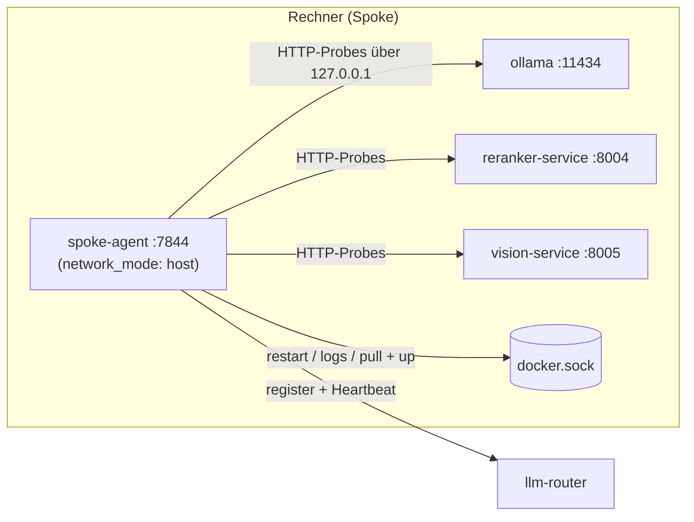

# spoke-stack

[](https://github.com/janpow77/spoke-stack/actions/workflows/ci.yml)

**Docker-Compose-Stack für einen Spoke im LLM-Router-Verbund: Ollama, Reranker, Vision-Dienst und der [`spoke-agent`](https://github.com/janpow77/spoke-agent), der den Rechner beim zentralen [`llm-router`](https://github.com/janpow77/llm-router) anmeldet. Ein Stack pro Rechner, mit Overrides für NVIDIA und AMD-ROCm.**

## Auf einen Blick

| Dienst | Port | Image | Zweck |
|---|---|---|---|
| `ollama` | 11434 | `ollama/ollama` (`:rocm` bei AMD) | LLM-Inferenz und Embeddings |
| `reranker-service` | 8004 | `ghcr.io/janpow77/reranker-service` | Cross-Encoder-Reranking (Default `BAAI/bge-reranker-v2-m3`) |
| `vision-service` | 8005 | `ghcr.io/janpow77/vision-service` | Bildverständnis/OCR (Donut CORD-v2) <!-- TODO: compose.yaml nennt den Dienst im Kopf noch "PLACEHOLDER bis Code fertig", im Dienstblock aber Donut + Tesseract/EasyOCR – Stand klären --> |
| `spoke-agent` | 7844 | `ghcr.io/janpow77/spoke-agent` | Discovery, Heartbeat zum Router, Admin-UI |

- **Ein Befehl pro Rechner:** `install.sh` legt Konfiguration und Datenverzeichnisse an, erkennt die GPU und startet den Stack.
- **GPU-Overrides:** [`compose.gpu.yaml`](compose.gpu.yaml) für NVIDIA, [`compose.amd.yaml`](compose.amd.yaml) für AMD-ROCm (u. a. Strix Halo/gfx1151); ohne GPU läuft alles auf der CPU.
- **Verwaltung über die Oberfläche:** Der `spoke-agent` startet, stoppt und aktualisiert die übrigen Container über den Docker-Socket; Einstellungen je Dienst landen in `/var/lib/spoke-agent/services/<dienst>.env` und werden beim nächsten Start übernommen.
- **Modelle übernehmen:** `OLLAMA_DATA_DIR` kann auf ein vorhandenes Ollama-Modellverzeichnis zeigen, sodass nichts neu geladen werden muss.

## Architektur



Der `spoke-agent` läuft im Host-Netz, damit er die anderen Dienste unter `127.0.0.1:<port>` erreicht; die Compose-Datei bekommt er read-only aus `/etc/spoke-stack` eingehängt.

## Schnellstart

Voraussetzungen: Linux mit Docker und `docker compose`-Plugin; bei NVIDIA das NVIDIA Container Toolkit, bei AMD ROCm mit `/dev/kfd` und `/dev/dri`.

```bash
git clone https://github.com/janpow77/spoke-stack.git
cd spoke-stack
./install.sh                     # legt /etc/spoke-stack/env aus .env.example an
sudoedit /etc/spoke-stack/env    # SPOKE_NAME, ROUTER_URL, Tokens setzen, CHANGEME-Werte ersetzen
./install.sh                     # startet den Stack
```

`install.sh` bricht ab, solange in `/etc/spoke-stack/env` noch `CHANGEME`-Platzhalter stehen. Danach ist die Oberfläche unter `http://localhost:7844/admin/` erreichbar, Logs gibt es mit `sudo docker logs -f spoke-agent`.

Die Compose-Dateien lassen sich ohne Installation prüfen (so auch in der CI):

```console
$ cp .env.example .env
$ docker compose --env-file .env -f compose.yaml config --services
ollama
reranker-service
spoke-agent
vision-service
```

<details><summary><b>Was <code>install.sh</code> genau macht</b></summary>

1. Prüft, ob Docker und das Compose-Plugin vorhanden sind.
2. Legt `/etc/spoke-stack`, `/var/lib/spoke-agent`, `/var/lib/reranker/data`, `/var/lib/ollama` und `/var/lib/vision/data` an.
3. Kopiert `.env.example` nach `/etc/spoke-stack/env` (Rechte `600`), falls noch nicht vorhanden; ist `$EDITOR` gesetzt, öffnet es die Datei.
4. Bricht mit Exit-Code 2 ab, wenn noch `CHANGEME`-Werte enthalten sind.
5. Kopiert `compose.yaml` (und Overrides) nach `/etc/spoke-stack/`.
6. Erkennt die GPU: NVIDIA über `nvidia-smi -L` → `compose.gpu.yaml`, AMD über `rocminfo` → `compose.amd.yaml`, sonst CPU.
7. Führt `docker compose … --env-file /etc/spoke-stack/env up -d` aus und zeigt `ps`.

</details>

<details><summary><b>Automatische Einrichtung mit <code>bootstrap.sh</code></b></summary>

Für frische Linux-Rechner (apt, dnf oder pacman; unter macOS bricht das Skript ab – dort Docker Desktop plus `./install.sh`):

```bash
curl -fsSL https://raw.githubusercontent.com/janpow77/spoke-stack/master/bootstrap.sh | sudo bash
```

Mit vorgegebenen Werten:

```bash
sudo SPOKE_NAME=<name> SPOKE_TAGS=gpu,linux \
     ROUTER_URL=http://<router>:<port> \
     SPOKE_REGISTRATION_TOKEN=<token> \
     bash bootstrap.sh
```

Ablauf laut Skript:

1. **Pre-Flight** (Abbruch bei Fehler): bash ≥ 4, `curl`, `git`, `jq`; mindestens 20 GB frei unter `/var/lib`; Tailscale (wird bei Bedarf installiert und per `tailscale up` verbunden; ohne Tailscale-IP Abbruch); Erreichbarkeit des Routers und Belegung des Spoke-Namens (nur Warnung); Docker; GPU-Erkennung (NVIDIA, AMD, Intel, CPU) inklusive Installation des NVIDIA Container Toolkit bzw. Prüfung der ROCm-Geräte und der Gruppen `video`/`render`; Portbelegung; vorhandene Ollama-Installation; Registrierungstoken kein `CHANGEME`-Platzhalter (fehlt es, nur Warnung).
2. Optional `docker login ghcr.io` mit `GHCR_TOKEN` (`GHCR_USER`).
3. Repo nach `/opt/spoke-stack` klonen bzw. aktualisieren.
4. `/etc/spoke-stack/env` schreiben: Name, Tags je GPU-Typ, Bind-Adressen, `GPU_COUNT`, Parallelität nach VRAM/RAM, `HSA_OVERRIDE_GFX_VERSION` und Gruppen-IDs bei AMD.
5. **Übernahme einer vorhandenen Ollama-Installation:** Läuft ein `ollama`-systemd-Dienst, werden alle `ollama*`-Units gestoppt, deaktiviert und entfernt sowie `/usr/local/bin/ollama` gelöscht. Die Modelle bleiben im bisherigen Verzeichnis, das als `OLLAMA_DATA_DIR` eingetragen wird.
6. `docker compose pull` und `up -d` mit passendem GPU-Override.
7. **Validierung:** Container laufen und sind gesund, Ollama-Modelle sichtbar, `/health` von Reranker und Agent, Spoke im Router (mit `ROUTER_ADMIN_TOKEN`), kurzer Inferenztest mit dem kleinsten Modell. Schlägt die Einrichtung fehl, rollt das Skript zurück (`docker compose down`, Host-Ollama wieder starten).

Schalter: `SKIP_PREFLIGHT=1`, `SKIP_VALIDATE=1`.

> **Hinweis zur Sicherheit:** `bootstrap.sh` setzt `OLLAMA_BIND`, `RERANKER_BIND` und `VISION_BIND` auf `0.0.0.0`. Ollama hat keine eigene Authentifizierung. Ist `ufw` aktiv, beschränkt das Skript die Spoke-Ports auf das Tailscale-Netz (`100.64.0.0/10`); sonst sind die Ports im LAN erreichbar.

<!-- TODO: bootstrap.sh prüft in check_ports und nennt in der Zusammenfassung Port 7700 für die Agent-UI, compose.yaml und install.sh verwenden 7844. Außerdem nutzt bootstrap.sh als ROUTER_URL-Default Port 7842, .env.example und compose.yaml Port 8080. -->

</details>

<details><summary><b>Konfiguration (<code>/etc/spoke-stack/env</code>)</b></summary>

Vorlage ist [`.env.example`](.env.example). Wichtige Variablen:

| Variable | Default | Zweck |
|---|---|---|
| `OLLAMA_TAG`, `RERANKER_TAG`, `VISION_TAG`, `SPOKE_AGENT_TAG` | `latest` | Image-Tags |
| `SPOKE_NAME` | — (pro Rechner eindeutig) | Name des Spokes im Router |
| `SPOKE_TAGS` | — | Tags, kommagetrennt (z. B. `gpu,linux`) |
| `APP_ID` | — | optionale App-ID vom Router |
| `ROUTER_URL` | interne Adresse <!-- TODO: Default in .env.example/compose.yaml ist eine private Netzadresse; immer setzen --> | Primärer Router |
| `FALLBACK_ROUTER_URL` | — | Ausweich-Router nach 3 Fehlschlägen |
| `API_KEY` | — | Bearer-Token für den Router |
| `SPOKE_REGISTRATION_TOKEN` | — | Header `X-Spoke-Token` bei der Registrierung |
| `SPOKE_AGENT_ADMIN_PASSWORD` | `spoke-admin` (Compose-Fallback) | Login der Oberfläche |
| `SPOKE_AGENT_AUTH` | `on` | `off` schaltet den Login ab – nur in abgeschotteten Netzen |
| `SPOKE_AGENT_PORT` | `7844` | Port des Agents |
| `OLLAMA_BIND`, `RERANKER_BIND`, `VISION_BIND` | `127.0.0.1` (Vorlage) | Bind-Adresse der Dienste; ohne Eintrag gilt in `compose.yaml` `0.0.0.0` |
| `OLLAMA_DATA_DIR` | `/var/lib/ollama` | Modellverzeichnis auf dem Host |
| `OLLAMA_KEEP_ALIVE`, `OLLAMA_NUM_PARALLEL`, `OLLAMA_MAX_LOADED_MODELS`, `OLLAMA_FLASH_ATTENTION`, `OLLAMA_NUM_CTX` | `24h`, `2`, `2`, `1`, `8192` | Ollama-Tuning |
| `GPU_COUNT` | `1` | Anzahl GPUs für die NVIDIA-Reservierung |
| `RERANKER_DEVICE` | `cpu` | im NVIDIA-Override fest `cuda`, im AMD-Override `cpu` |
| `RERANKER_DEFAULT_MODEL`, `RERANKER_PRELOAD_MODELS` | `BAAI/bge-reranker-v2-m3` | Reranker-Modelle |
| `VISION_DEVICE` | `cpu` | Gerät des Vision-Dienstes |
| `RERANKER_API_KEY`, `VISION_API_KEY` | leer | optionale API-Keys der Dienste |

Nur im AMD-Override: `HSA_OVERRIDE_GFX_VERSION` (Default `11.5.1`), `VIDEO_GID`/`RENDER_GID` (Default `44`/`993`), `HSA_ENABLE_SDMA`, `OLLAMA_KV_CACHE_TYPE` (`q8_0`) und weitere – siehe Kommentare in [`compose.amd.yaml`](compose.amd.yaml).

**Beispiele nach Hardware**

```env
# NVIDIA
SPOKE_TAGS=gpu,linux,nvidia
RERANKER_DEVICE=cuda

# AMD mit ROCm
SPOKE_TAGS=gpu,linux,amd,rocm

# macOS (ohne NVIDIA, compose.gpu.yaml nicht verwenden)
SPOKE_TAGS=apple-metal,arm64
RERANKER_DEVICE=cpu
```

</details>

<details><summary><b>Dateien und Verzeichnisse auf dem Host</b></summary>

| Pfad | Inhalt |
|---|---|
| `/etc/spoke-stack/env` | Konfiguration (Rechte `600`) |
| `/etc/spoke-stack/compose*.yaml` | Kopien der Compose-Dateien, vom Agent gelesen |
| `/var/lib/spoke-agent` | Zustand des Agents, Dienst-Overrides unter `services/` |
| `/var/lib/ollama` | Ollama-Modelle (oder `OLLAMA_DATA_DIR`) |
| `/var/lib/reranker/data`, `/var/lib/vision/data` | Hugging-Face-Cache der Dienste |
| `/opt/spoke-stack` | Arbeitskopie bei Einrichtung über `bootstrap.sh` |

Manuell mit GPU starten: `docker compose -f compose.yaml -f compose.gpu.yaml up -d` (NVIDIA) bzw. `-f compose.amd.yaml` (AMD).

</details>

## CI

[`ci.yml`](.github/workflows/ci.yml) prüft bei jedem Push und Pull Request auf `master`/`main` die Compose-Dateien mit `docker compose config` (CPU und NVIDIA) und lässt `shellcheck` über `install.sh` laufen (nicht blockierend).

## Verwandte Repos

- [spoke-agent](https://github.com/janpow77/spoke-agent) – Agent mit Admin-Oberfläche (FastAPI + Vue)
- [spoke-widget](https://github.com/janpow77/spoke-widget) – Tray-App für den Desktop
- [llm-router](https://github.com/janpow77/llm-router) – zentraler Router
- [reranker-service](https://github.com/janpow77/reranker-service) · [vision-service](https://github.com/janpow77/vision-service)

## Lizenz

<!-- TODO: Keine LICENSE-Datei im Repo. -->
Keine Lizenzdatei vorhanden.
